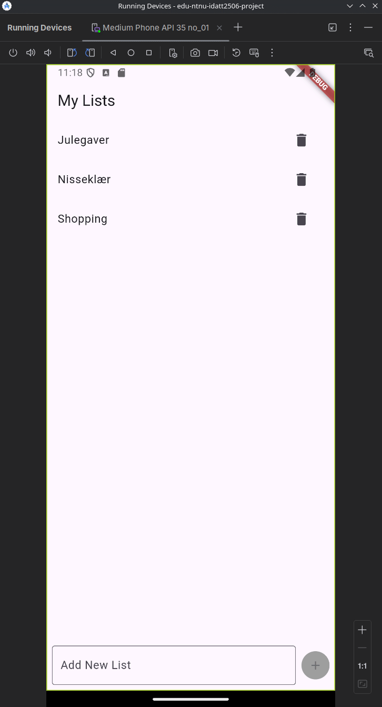

# IDATT2506 Mobile App Development - Assignment 08 - Crossplatform To Do App

Multi-Platform To Do List App written in Dart using Flutter.

The design of the app is based on tried and true design patterns for notes- and To Do apps, seen in apps like Apple Reminders, Apple Notes, Google Keep, and Microsoft To Do.

Here be no triangular wheels, only round ones.

#### Demo of the app
A short demo of the app, running on an Android emulator.
Showing input via both on-screen keyboard and physical keyboard.



## Requirements

- Java JDK 21
- Gradle
- Flutter SDK
- Dart SDK
- Android Studio
- Android Emulator or physical device
- Android SDK
- Android 15 "Vanilla Ice Cream" API level 35
- Flutter and Dart plugins for Android Studio


## Testing/Running the app

The simplest way to run the solution is to use an Android emulator through Android Studio.

Steps to run the app:
- Install Android Studio, Android SDK, Java JDK21, Flutter and Dart SDK.
- Unzip the file containing the source code into a suitable folder, e.g. `assignment_08_todo_project`
- Open Android Studio, and open the folder where you unzipped the code as a new project.
- Set up an emulator device (Medium Phone, API level 35, Android 15 "Vanilla Ice Cream") and start it via Device Manager by clicking the "Play" button (white-grey arrow).
- To run the app on the emulated device, press the large green "Play" button in the top right of the UI in Android Studio.
- The app should now be running on the emulator device.
- You can now interact with the app as you would on a physical device.

#### pubspec.yaml

```yaml
name: assignment_08_project
description: "Multi-Platform To Do List App"

publish_to: 'none' 

version: 1.0.0+1

environment:
  sdk: ^3.5.4

dependencies:
  path_provider: ^2.1.5
  flutter:
    sdk: flutter
  uuid: ^4.5.1
  cupertino_icons: ^1.0.8

dev_dependencies:
  flutter_test:
    sdk: flutter

flutter:
  uses-material-design: true
```

#### settings.gradle

```gradle
pluginManagement {
    def flutterSdkPath = {
        def properties = new Properties()
        file("local.properties").withInputStream { properties.load(it) }
        def flutterSdkPath = properties.getProperty("flutter.sdk")
        assert flutterSdkPath != null, "flutter.sdk not set in local.properties"
        return flutterSdkPath
    }()

    includeBuild("$flutterSdkPath/packages/flutter_tools/gradle")

    repositories {
        google()
        mavenCentral()
        gradlePluginPortal()
    }
}

plugins {
    id "dev.flutter.flutter-plugin-loader" version "1.0.0"
    id "com.android.application" version "8.7.2" apply false
    id "org.jetbrains.kotlin.android" version "2.0.20" apply false
}

include ":app"
```

#### gradle-wrapper.properties

```gradle
distributionBase=GRADLE_USER_HOME
distributionPath=wrapper/dists
distributionUrl=https\://services.gradle.org/distributions/gradle-8.11.1-bin.zip
networkTimeout=10000
validateDistributionUrl=true
zipStoreBase=GRADLE_USER_HOME
zipStorePath=wrapper/dists
```


## Getting Started with Flutter

This project is a starting point for a Flutter application.

A few resources to get you started if this is your first Flutter project:

- [Lab: Write your first Flutter app](https://docs.flutter.dev/get-started/codelab)
- [Cookbook: Useful Flutter samples](https://docs.flutter.dev/cookbook)

For help getting started with Flutter development, view the
[online documentation](https://docs.flutter.dev/), which offers tutorials,
samples, guidance on mobile development, and a full API reference.
